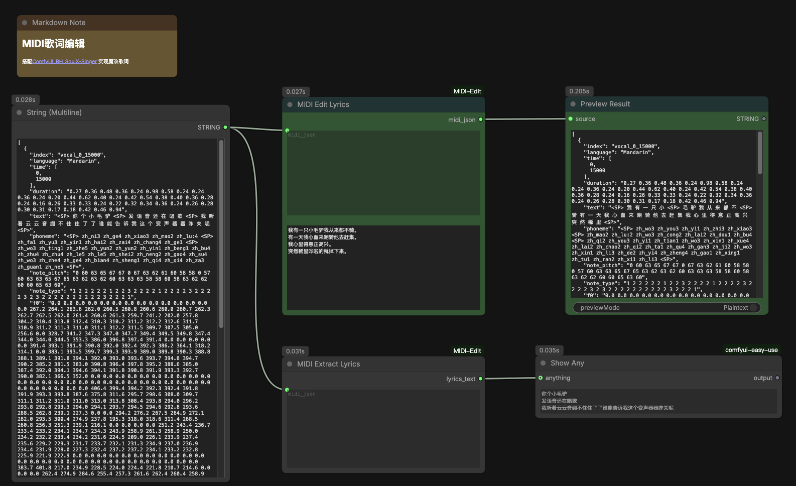

# ComfyUI-MIDI-Edit

[ComfyUI](https://github.com/comfyanonymous/ComfyUI) 自定义节点插件，搭配 [ComfyUI_RH_SoulX-Singer](https://github.com/HM-RunningHub/ComfyUI_RH_SoulX-Singer) 实现魔改歌词——替换 MIDI JSON 中的歌词文本并自动生成拼音/音素，也可从 MIDI JSON 中提取歌词。适用于 MIDI 歌曲生成工作流，支持中文和英文。

提供三个节点：

- **MIDI Edit Lyrics** — 替换歌词并自动生成音素
- **MIDI Extract Lyrics** — 提取歌词文本（去空格，`<SP>` 转换行）
- **MIDI Merge Repeated Chars** — 合并连续重复字符

---

## 功能特性

- 歌词替换 + 自动音素生成
- 歌词提取
- 连续重复字符合并
- 支持中文（`zh_` 前缀拼音）和英文（`en_` 前缀音素）
- `<SP>` 标记自动保留，不影响音素对齐
- **智能匹配算法**：3 种模式自动适配新旧歌词长度差异
  - **Collapse**（新词 ≤ 去重 slot 数）：右对齐映射，保护结尾长音
  - **Collapse+Distribute**（slot 数 < 新词 ≤ token 数）：多字 slot 内分配不同字，尊重原曲重复结构
  - **Expand**（新词 > token 数）：自动拆分最长 token（duration 减半，pitch 不变）
- **CT-Transformer 智能拆句**：当用户歌词按标点/换行切分后句子数不等于原曲 section 数时触发
  - 按原曲每个 section 的 token 数比例计算预期字数（四舍五入 + 最后兜底）
  - 从第一句开始，CT-Transformer 加标点后取第一个标点切分
  - 如果切点处字数与预期相差不超过 ±30%（向上取整），使用 AI 切点；否则按预期字数硬切
  - 切完后去掉所有标点，剩余歌词继续处理下一个 section
  - 句子数与原曲 section 数一致时不触发此逻辑，走原来的 collapse/expand 匹配
- **长音自动展开**：MIDI 中连续重复字（如 `天 天` 表示同一字两个不同音高）会自动将用户输入的字按相同次数展开
- **高音强制第四声**（可选）：当 `force_tone4` 开启时，高音区（默认 ≥ G5）的中文拼音强制转为第四声
- **最小 duration 保障**：所有非 SP token 的 duration 不低于 0.30s，从同 section 最长 token 借时间

---

## 安装

### 依赖

- ComfyUI
- Python conda 环境 `comfyui`
- `g2pM>=0.1.2.5`
- `g2p_en>=2.1.0`
- `modelscope`（CT-Transformer 模型下载）
- `onnxruntime>=1.17.0`（CT-Transformer 推理）
- NLTK 数据（插件首次运行自动下载到本地 `models/nltk/`）
- CT-Transformer 标点恢复模型（首次使用智能拆句时自动下载到 ComfyUI `models/ct-transformer-punc/`，~270MB）

### 安装步骤

```bash
# 1. 克隆到 ComfyUI custom_nodes 目录
cd ~/App/ComfyUI/custom_nodes
ln -s /path/to/ComfyUI-MIDI-Edit ComfyUI-MIDI-Edit

# 2. 安装 Python 依赖
conda activate comfyui
pip install g2pM g2p_en modelscope onnxruntime

# 3. 重启 ComfyUI
```

NLTK 数据会自动下载到项目内的 `models/nltk/` 目录，无需手动操作。

CT-Transformer 标点恢复模型会在首次需要智能拆句时自动从 ModelScope 下载到 ComfyUI 的 `models/ct-transformer-punc/` 目录（~270MB），无需手动操作。

---

## 节点说明

### MIDI Edit Lyrics

替换 MIDI JSON 中的歌词并自动生成对应音素。

**输入：**

| 字段 | 类型 | 说明 |
|------|------|------|
| `midi_json` | STRING, multiline | MIDI JSON 字符串 |
| `new_lyrics` | STRING, multiline | 新歌词文本 |
| `force_tone4` | BOOLEAN | 高音强制第四声（默认 OFF） |
| `high_pitch_threshold` | INT | 高音阈值 0-127（默认 79 = G5） |

**输出：**

| 字段 | 类型 | 说明 |
|------|------|------|
| `midi_json` | STRING | 修改后的 MIDI JSON 字符串 |

**处理逻辑：**

1. 新歌词按换行和标点（，。！？；：等）切分为句子
2. 每个句子映射到原曲的一个 MIDI section（`<SP>` 分隔的段落）
3. 如果句子数 ≠ 原 section 数，使用 **比例分配 + AI 切分**算法：
   - 按原曲每个 section 的 token 数比例计算预期字数
   - 逐 section 处理：CT-Transformer 加标点，取第一个标点切分
   - 切点字数在预期 ±30% 内 → 用 AI 切点；否则按预期硬切
   - 句子数 = 原 section 数时不触发，走下方的 collapse/expand 逻辑
4. 每个 section 内使用 3 种模式匹配：
   - **Collapse**（新字数 ≤ 去重 slot 数）：右对齐映射到 slot，保护结尾长音
   - **Collapse+Distribute**（slot 数 < 新字数 ≤ token 数）：slot 内多个 token 分配不同的字（如原曲 `天天` → 新歌词 `把它`）
   - **Expand**（新字数 > token 数）：拆分最长 duration 的 token（减半，pitch 不变）
5. 原曲连续重复字（如 `天 天`）collapse 为 1 个 slot 后展开，新字自动按重复数复制
6. 为每个替换的字自动生成音素（中文 → `zh_` 拼音，英文 → `en_` 音素）
7. 空 token 的 duration 重分配给同 section 的已填 token
8. 所有非 SP token 的 duration 不低于 0.30s

**分类：** `MIDI-Edit`

---

### MIDI Extract Lyrics

从 MIDI JSON 中提取歌词文本。

**输入：**

| 字段 | 类型 | 说明 |
|------|------|------|
| `midi_json` | STRING, multiline | MIDI JSON 字符串 |

**输出：**

| 字段 | 类型 | 说明 |
|------|------|------|
| `lyrics_text` | STRING | 提取的歌词文本 |

**处理逻辑：**

1. 遍历所有 track，拼接 `text` 字段
2. 去除所有空格
3. 将 `<SP>` 替换为换行符

**分类：** `MIDI-Edit`

---

## MIDI JSON 格式说明

MIDI JSON 为一个 track 对象数组，每个 track 包含以下字段：

```json
[
  {
    "text": "<SP> 我 有 一 只 小 <SP> 毛 驴 <SP>",
    "phoneme": "<SP> zh_wo3 zh_you3 zh_yi1 zh_zhi1 zh_xiao3 <SP> zh_mao2 zh_lu:2 <SP>",
    "duration": "0.27 0.36 0.48 0.36 0.24 0.98 0.24 0.36",
    "note_pitch": "0 60 63 65 67 67 0 60",
    "note_type": "1 2 2 2 2 1 2 2",
    "f0": "0.0 0.0 0.0 0.0 0.0 0.0 0.0 0.0"
  }
]
```

字段说明：

| 字段 | 说明 |
|------|------|
| `text` | 歌词文本，空格分隔各字/词，`<SP>` 表示停顿 |
| `phoneme` | 音素序列，与 `text` 一一对应 |
| `duration` / `note_pitch` / `note_type` / `f0` | 非歌词字段，替换时不修改 |

---

## 使用示例

### 示例 1：替换歌词

输入 MIDI JSON 的 text：`<SP> 你 个 小 毛 驴 <SP> 发 语 音 <SP>`

输入新歌词：`红鲤鱼与绿鹦鹉`

输出 text：`<SP> 红 鲤 鱼 与 <SP> 发 语 音 <SP>`

> 前 4 个 slot 替换，多余 2 字忽略，原文后段保留。

### 示例 2：智能拆句（句子数 ≠ 原 section 数）

当新歌词句子数不等于原曲 section 数时，按原曲 token 比例分配字数，AI 辅助切分：

原曲 4 个 section，token 数：8 / 8 / 8 / 7 = 31

新歌词（无标点整段）：`如果你觉得有点累送你个小炸弹把它扔给你的烦恼把烦恼都炸飞拉上你的老闺蜜呀`（36 字）

按比例分配预期字数：9 / 9 / 9 / 9（四舍五入 + 最后兜底）

逐 section AI 切分：
- Section 1：AI 加标点 → `如果你觉得有点累，送你个小炸弹...` → 第一个标点前 8 字，与预期 9 字偏差 1 ≤ 3 → 采用 → `如果你觉得有点累`
- Section 2：AI 加标点 → `送你个小炸弹，把它扔给你的烦恼...` → 6 字，偏差 3 ≤ 3 → 采用 → `送你个小炸弹`
- Section 3：AI 加标点 → `把它扔给你的烦恼，把烦恼都炸飞...` → 8 字，偏差 1 ≤ 3 → 采用 → `把它扔给你的烦恼`
- Section 4：最后 section 收剩余 → `把烦恼都炸飞拉上你的老闺蜜呀`

### 示例 3：Collapse+Distribute 模式

MIDI 中连续重复字表示长音（占多个音节）。用户输入不需要手动写重复字，插件会自动展开匹配。

输入 MIDI JSON 的 text：`敌 敌 人 不 敢 靠 近 近 近 你`

（slots：敌×2, 人×1, 不×1, 敢×1, 靠×1, 近×3, 你×1 = 7 个 slot）

输入新歌词：`一二三四五六七`

输出 text：`一 一 二 三 四 五 近 近 近 你`

> "敌敌"（长音 2 拍）→ 用户写"一"自动展开为"一一"；"近近近"（长音 3 拍）→ 用户写"六"自动展开为"六六六"。

### 示例 4：提取歌词

输入 MIDI JSON 的 text：`<SP> 我 有 一 只 小 <SP> 毛 驴 我 从 来 都 不 <SP> 骑 有 一 天 <SP>`

输出：

```
我有一只小
毛驴我从来都不
骑有一天
```

---

## 工作流示例

完整 ComfyUI 工作流，展示 MIDI Edit Lyrics + MIDI Extract Lyrics 双路径并行处理：



- [下载工作流 JSON](docs/midi-edit-lyrics.json)（拖入 ComfyUI 界面即可使用）

---

## ComfyUI API 调用示例

通过 HTTP API 调用 `MIDI Edit Lyrics` 节点：

```bash
curl -s http://127.0.0.1:8188/prompt \
  -H "Content-Type: application/json" \
  -d '{
    "prompt": {
      "1": {
        "class_type": "MIDIEditLyrics",
        "inputs": {
          "midi_json": "[{\"text\":\"<SP> 你 好 <SP>\",\"phoneme\":\"<SP> zh_ni3 zh_hao3 <SP>\"}]",
          "new_lyrics": "红鲤鱼"
        }
      },
      "2": {
        "class_type": "PreviewAny",
        "inputs": {
          "source": ["1", 0]
        }
      }
    }
  }'
```

---

## 注意事项

- `g2pM` 首次使用时会自动下载模型（与 NLTK 数据分开）
- NLTK 数据存储在项目 `models/nltk/` 目录下，不影响系统环境
- CT-Transformer 标点恢复模型首次使用时自动从 ModelScope 下载到 ComfyUI `models/ct-transformer-punc/`（~270MB）
- 歌词替换支持**任意长度差异**的新旧歌词（Collapse / Collapse+Distribute / Expand 三种模式自动选择）
- `<SP>` 标记始终保留，f0（帧级数据）完全不做修改

---

## 项目结构

```
ComfyUI-MIDI-Edit/
├── __init__.py          # ComfyUI 插件入口，导出节点映射
├── nodes.py             # 核心逻辑与节点定义
├── requirements.txt     # Python 依赖
├── pyproject.toml       # Comfy Registry 发布配置
├── CHANGELOG.md         # 更新日志
├── docs/
│   ├── REQUIREMENT.md   # 原始需求文档
│   ├── midi-edit-lyrics.json       # ComfyUI 工作流文件
│   └── midi-edit-lyrics.json.png   # 工作流截图
├── models/
│   └── nltk/            # NLTK 数据（自动下载）
└── README.md
```
